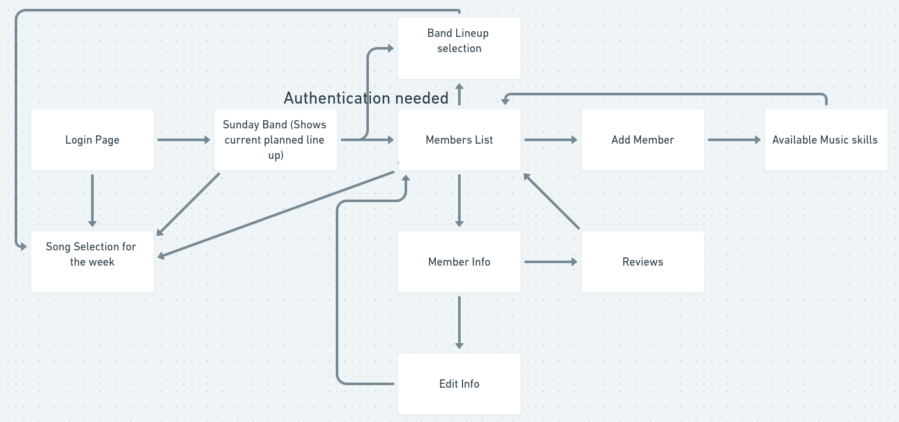
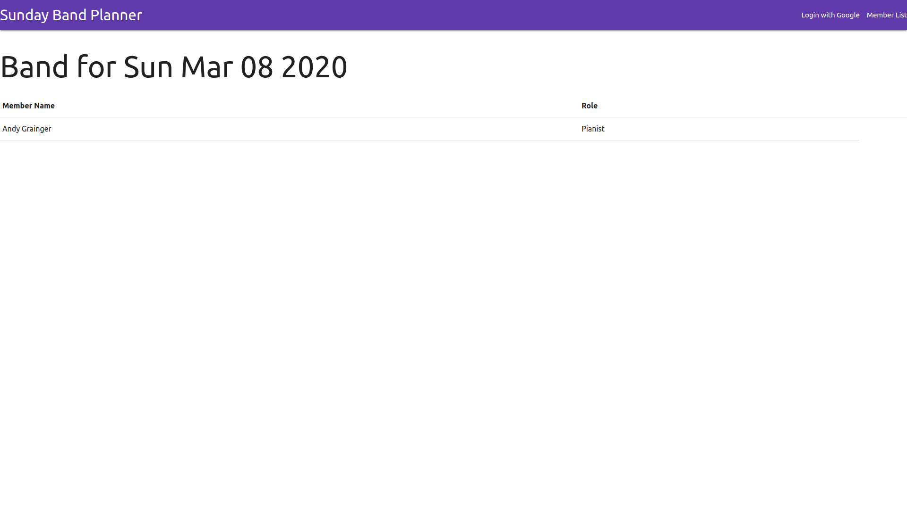
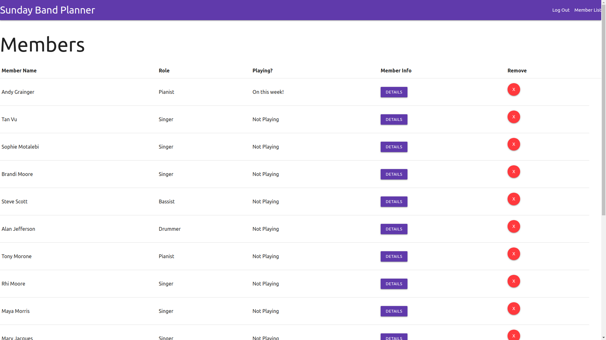
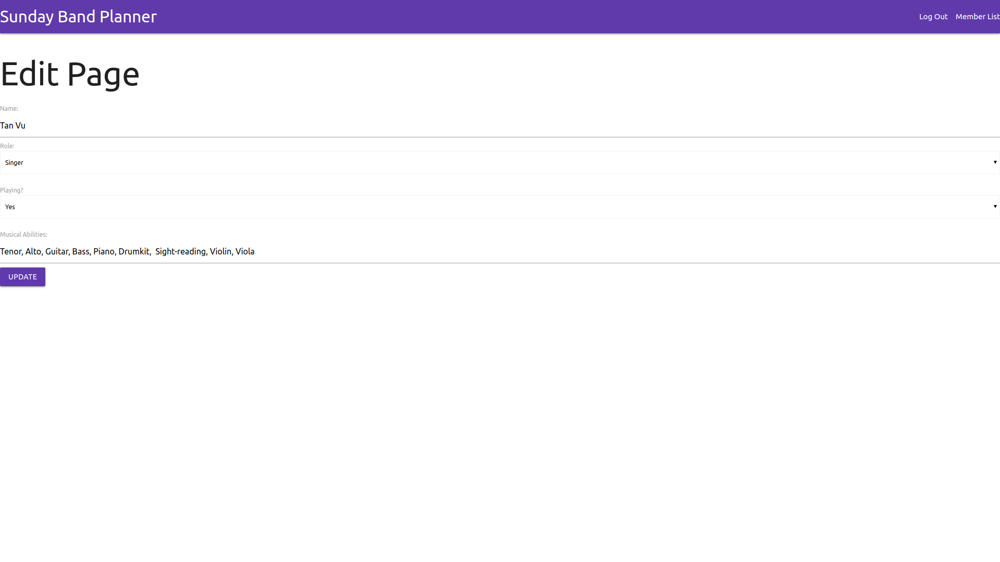
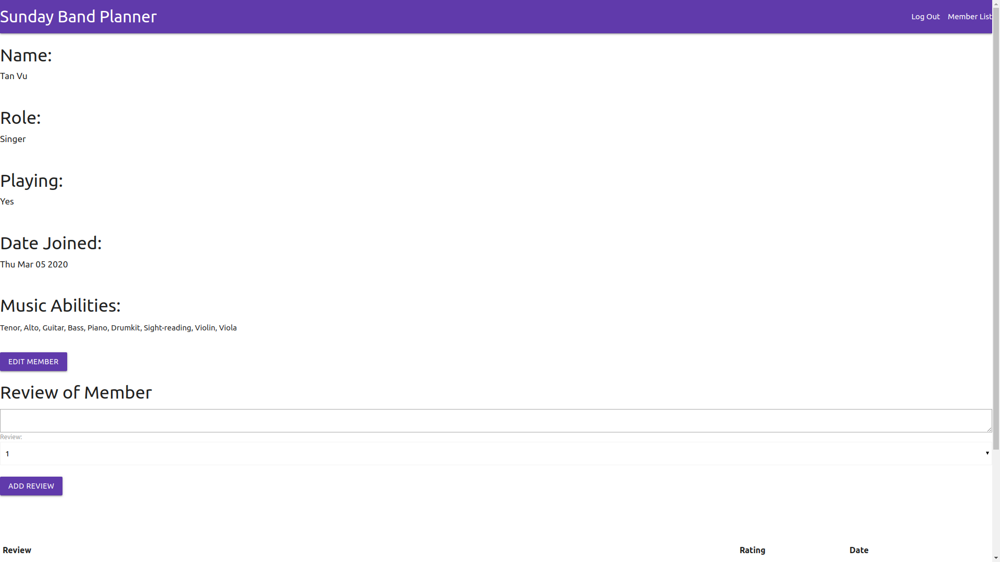

# Project-Two
<h2>Sunday-Band-Planner</h2>

This application came to me when I was thinking of a more practical application that could be used in my everyday life. Being part of a church band and knowing the pains of managing, I decided to create this application to ease the mundane task.

<h2>Objective:</h2>

Create an application with full CRUD functionality

<h2>Launch the application! </h2>

<a target="_blank" rel="noopener noreferrer" href="https://sunday-band-planner.herokuapp.com/">Sunday-Band-Planner</a>
 
<h2>Trello</h2>

<a target="_blank" rel="noopener noreferrer" href="https://trello.com/b/kX6lgmwK/sunday-band-planner">My Workflow space</a>

<h2>Prototype View:</h2>
 
<h2>Screenshots</h2>
  
 
 
 
<h2>Technologies Used</h2>

This program was built with: 
 
- JavaScript  
- HTML  
- CSS  
- Express  
- Node.js  
- Heroku  
- Materialize  
- MangoDB atlas  
- Google People's Api  
- Oauth  
- Git
<h2>Next Steps</h2>
1. Add Delete and Edit functions to reviews and comments  
2. Calendar function instead of displaying Sunday's date  
3. Song Selection Function and Display  
4. Song selection history and saved into database 